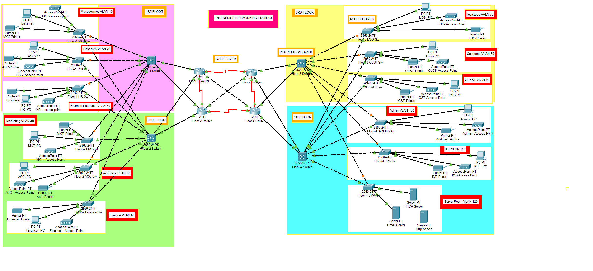

# 🏦 ABC Company Ltd. - Bank Network Design (Cisco Packet Tracer)

A professional, scalable, and secure network simulation for **ABC Company Ltd.**, a leading banking and insurance firm expanding operations in Pakistan.

> 🔧 Built in **Cisco Packet Tracer** to simulate enterprise-grade networking solutions for 240 employees across **4 floors**.

## 📌 Project Overview

This project presents a complete hierarchical network design tailored to a mid-sized banking firm. The goal is to enable efficient, secure, and scalable communication while ensuring high availability and future-proofing for network expansion.

## 🎯 Project Goals

- ✅ Design a **Hierarchical Network Topology** with proper segmentation
- ✅ Enable both **Wired & Wireless Connectivity**
- ✅ Implement **VLANs** and **Inter-VLAN Routing**
- ✅ Configure **SSH & Port Security** for secure device access
- ✅ Ensure **Scalability** with future-readiness
- ✅ Use **Dynamic IP Allocation** via a dedicated DHCP Server
- ✅ Use **OSPF Routing Protocol** for efficient dynamic routing

## 🧠 Technologies & Features Implemented

- 🖥 **Cisco Packet Tracer**
- 🧱 Hierarchical Topology with core, distribution, and access layers
- 📶 Wireless Network Setup (Cisco Access Point)
- 🌐 VLANs created for departmental segmentation
- 🔁 **Inter-VLAN Routing** via Multilayer Switches (SVIs)
- 🔐 **SSH Configuration** for secure remote access
- 🔒 **Port Security** on all 12 switches to prevent MAC-based spoofing
- 🧮 **Subnetting** for structured IP addressing
- 📡 **Dynamic IP Assignment** using DHCP Server
- 🧭 **OSPF** as the primary dynamic routing protocol
- 🛠️ **Static IP assignment** for server room devices
- ✅ End-to-end **Connectivity Testing & Verification**

## 🏢 Floor-wise Department Distribution

| 🏢 Floor         | 🏬 Department         | 🖥 PCs | 🖨 Printers | 🗄️ Servers           |
|------------------|-----------------------|--------|--------------|----------------------|
| **1st Floor**    | Management            | 20     | 4            | -                    |
|                  | Research              | 20     | 4            | -                    |
|                  | Human Resource        | 20     | 4            | -                    |
| **2nd Floor**    | Marketing             | 20     | 4            | -                    |
|                  | Accounting            | 20     | 4            | -                    |
|                  | Finance               | 20     | 4            | -                    |
| **3rd Floor**    | Logistics & Store     | 20     | 4            | -                    |
|                  | Customer Care         | 20     | 4            | -                    |
|                  | Guest Area            | 40     | 2            | -                    |
| **4th Floor**    | Administration        | 20     | 2            | -                    |
|                  | ICT                   | 20     | 2            | -                    |
|                  | Server Room           | 2 Admin PCs | 0       | DHCP, HTTP, Email    |

## 🌐 Floor-wise IP Addressing & Subnetting Plan

Each department has been allocated a dedicated `/26` subnet for isolation, scalability, and simplified inter-VLAN routing. Below is a detailed breakdown:

### 🏢 First Floor

| Department       | Network Address | Subnet Mask              | Host IP Range               | Broadcast Address |
|------------------|------------------|---------------------------|------------------------------|-------------------|
| Management       | 192.168.10.0     | 255.255.255.192 (/26)     | 192.168.10.1 – 192.168.10.62 | 192.168.10.63     |
| Research         | 192.168.10.64    | 255.255.255.192 (/26)     | 192.168.10.65 – 192.168.10.126 | 192.168.10.127   |
| Human Resource   | 192.168.10.128   | 255.255.255.192 (/26)     | 192.168.10.129 – 192.168.10.190 | 192.168.10.191   |

### 🏢 Second Floor

| Department  | Network Address | Subnet Mask              | Host IP Range               | Broadcast Address |
|-------------|------------------|---------------------------|------------------------------|-------------------|
| Marketing   | 192.168.10.192   | 255.255.255.192 (/26)     | 192.168.10.193 – 192.168.10.254 | 192.168.10.255   |
| Accounts    | 192.168.11.0     | 255.255.255.192 (/26)     | 192.168.11.1 – 192.168.11.62 | 192.168.11.63     |
| Finance     | 192.168.11.64    | 255.255.255.192 (/26)     | 192.168.11.65 – 192.168.11.126 | 192.168.11.127   |

### 🏢 Third Floor

| Department        | Network Address | Subnet Mask              | Host IP Range               | Broadcast Address |
|-------------------|------------------|---------------------------|------------------------------|-------------------|
| Logistics & Store | 192.168.11.128   | 255.255.255.192 (/26)     | 192.168.11.129 – 192.168.11.190 | 192.168.11.191   |
| Customer Care     | 192.168.11.192   | 255.255.255.192 (/26)     | 192.168.11.193 – 192.168.11.254 | 192.168.11.255   |
| Guest Area        | 192.168.12.0     | 255.255.255.192 (/26)     | 192.168.12.1 – 192.168.12.62 | 192.168.12.63     |

### 🏢 Fourth Floor

| Department     | Network Address  | Subnet Mask              | Host IP Range                | Broadcast Address |
|----------------|-------------------|---------------------------|-------------------------------|-------------------|
| Administration | 192.168.12.64     | 255.255.255.192 (/26)     | 192.168.12.65 – 192.168.12.126 | 192.168.12.127   |
| ICT            | 192.168.12.128    | 255.255.255.192 (/26)     | 192.168.12.129 – 192.168.12.190 | 192.168.12.191   |
| Server Room    | 192.168.12.192    | 255.255.255.192 (/26)     | 192.168.12.193 – 192.168.12.254 | 192.168.12.255   |

## 🛠 Configuration Summary

| Configuration Area     | Description |
|------------------------|-------------|
| 🎛 Device Setup        | Basic configuration and hostnames for all routers/switches |
| 🧾 VLANs & Ports       | Created VLANs, assigned access & trunk ports |
| 🔐 Security            | SSH access setup + Port security applied on all switches |
| 🧮 IP Addressing       | Custom subnetting and IP address allocation |
| 🚦 Routing             | OSPF configured across routers and Layer 3 switches |
| 🖥 DHCP Server         | Configured to dynamically assign IPs to host devices |
| 🔁 Inter-VLAN Routing  | Enabled on Layer 3 switches with `ip helper-address` |
| 📡 WLAN                | Configured Cisco Access Point for wireless connectivity |
| 🧪 Testing             | Verified all configurations through ping and console tests |

## 🖼️ Network Topology

## 📁 Project File

You can download and explore the full `.pkt` file:

🔗 [`ABC-Bank-Network.pkt`](https://github.com/SaraArif6198/Bank-Network-Project/blob/main/Bank%20Network.pkt)

## ✅ Results

- Full inter-floor and inter-department communication tested successfully
- All VLANs isolated and routed securely through L3 switches
- SSH and port security validated on all core infrastructure
- DHCP and static IP assignments verified
- OSPF routes dynamically updated and optimized
- Wireless devices successfully integrated and tested

## 📚 How to Use This Project

1. Open the `.pkt` file in **Cisco Packet Tracer**
2. Power on all devices and review configurations
3. Test inter-VLAN communication, DHCP IP assignment, and WLAN access
4. Open CLI/console to observe OSPF routing tables, VLAN status, and SSH connectivity

## 🙋‍♀️ About the Author

**Sara Arif**  
🎓 Computer Science Student | Aspiring Network Engineer & Data Analyst  
🌐 [GitHub](https://github.com/SaraArif6198) | 💼 [LinkedIn](https://www.linkedin.com/in/sara-arif-7922642b8/)

## 📌 License

This project is for **educational and demonstration purposes**. All configurations are simulated using Cisco Packet Tracer.

